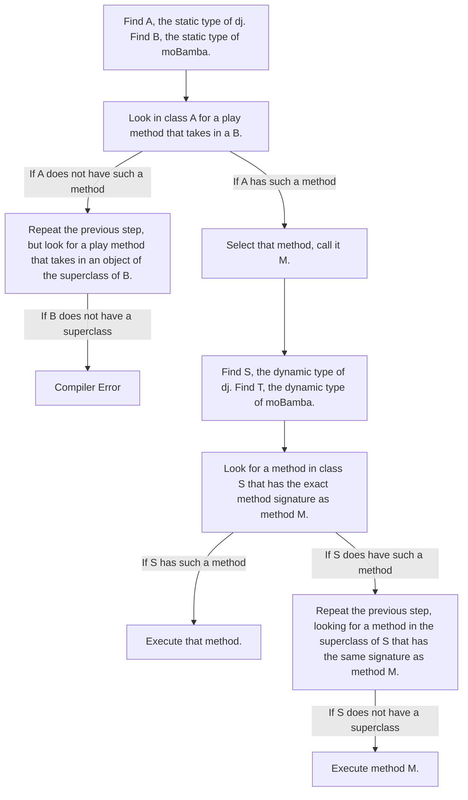

# Week 1: Objects, Arrays, Inheritance

This guide is meant to review some of the key ideas and point out common misconceptions with objects, arrays, and inheritance.

## Arrays

Let's start with the simple stuff: arrays. This should be review, but the main idea about arrays is that they are the "equivalent" of lists in Python. There are a few differences though.

**Common Mistake:** Many students forget that, unlike lists in Python, arrays in Java are of fixed length and the length of an array has to be specified when you instantiate it.

**Common Mistake:** Many students use the Python syntax for getting the length of an array. If I have an array `a` in Java, I can get the length using `a.length`.
> Note that `.length` is not a method of an array, but rather an attribute. For strings, getting the length requires using the `.length()` method (e.g. `s.length()`).

### 2-D Arrays
2-D arrays are a data structure that you will see _a lot_ in 61B, so you should get familiar with them ASAP. At a high level, a 2-D array is an array whose elements are pointers to other arrays. Here's a [diagram](https://docs.google.com/presentation/d/1bschu6cf74tviaPoFkzUECf3rQnlraOKlOReHxPTuxQ/edit?usp=sharing) of how I like to visualize 2-D arrays.

We looked at a problem in section called `flatten`, which takes in an `int[][] data` and returns a 1D array which contains all the elements in `data`. Here are some of the key takeaways from the problem:

**Key Takeaway:** Whenever you want to access all the values in a 2-D array, you need to write a _nested for-loop_. This just means writing one for-loop inside another for-loop.
```
// An example of a nested-for loop
for (int i = 0; i < 10; i++;) {
	for (int j = 0; j < 10; j++;) {
		System.out.print(i + j);
	}
}
```
However, as we saw in the section, writing for loops like these can get cumbersome really quickly when you have to keep track of 2 or more different sets of indices. Therefore, we looked at an alternate syntax for writing for-loops:
```
// data is a 2-D integer array
for (int[] col: data) {
	for (int elem: col) {
		System.out.print(elem);
	}
}
```
These kind of for-loops are easier to read and often easier to implement because they resemble English. If you were to say out loud what iterating through a 2-D array is in English, it would sound something like "For every column in the 2-D array, do something with each element of the column." Notice that this is really close to the code above.

Final note on 2-D arrays: Indexing into a 2-D array is no different than indexing into a normal 1-D array. For example, `data[0][0]` gets you to the first element in the first column of `data`.

## Objects

We can create objects by defining classes and instantiating instances of those classes.

### Golden Rule of Equals (Pass by Reference vs. Pass by Value)
Officially, the Golden Rule of Equals (also referred to as Pass by Reference or Pass by Value) states: "Given variables `a` and `b`, the assignment statement `a = b` copies all the bits from `b` into `a`."

I personally hate thinking about bits, so the way I remember this rule is with environment diagrams. When we execute the assignment `a = b`, we simply copy whatever is in the "box" for `b` into the box for `a`. So if `b` is an integer or any other primitive type, we simply copy the primitive into the "box" for `a`.  If `b` is bound to an object, then what's actually in the "box" for `b` is a _pointer_, or reference, to the object. Therefore, we just copy the pointer into the "box" for `a`.

**Common Mistake:** Many students forget that the Golden Rule of Equals also applies when passing variables in as arguments to a method. If a method takes in an object as a parameter, what actually gets passed in is a pointer to the object that is being passed in.

**Key Takeaway:** Drawing environment diagrams really helps to see what is actually going on in your program. Use these diagrams so you don't miss easy points on an exam because you made a careless mistake in your head.

## Inheritance

Inheritance refers to the way classes relate to each other. Some classes are children of their *superclass* and other classes have children classes, or _subclasses_. Class `A` is a subclass of class `B` if `A extends B`. 

**Common Mistake:** Many students forget that any call to the constructor method of a class begins with a call to the constructor method of its superclass. This makes sense intuitively. If you are trying to make a `Beagle`, you first need to make a `Dog` so that you can inherit its methods and attributes. 

> Note: For the record, although I used `Beagle` in the example, German Shepherds are the best dogs and you can't convince me otherwise.

### Dynamic Method Selection
Dynamic method selection is the process that is run to execute any method call in Java. This topic is a favorite for Midterm 1 questions, so make sure you understand it.

I could list out the steps of dynamic method selection, but it gets a little confusing to follow because there are so many steps. Thus, I'll show the process of dynamic method selection with a flowchart.

Assuming we are executing a method call `dj.play(moBamba)`:


> This diagram assumes that the instantiation of the objects `dj` and `moBamba` are valid (i.e. that their dynamic type is of the same class or a subclass of their static type).

## Conclusion

I hope you found this guide helpful! As always, if you have any questions about something I said here (or anything else) please reach out to me and I would be more than happy to answer!


