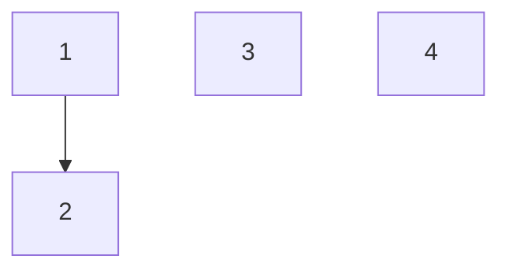
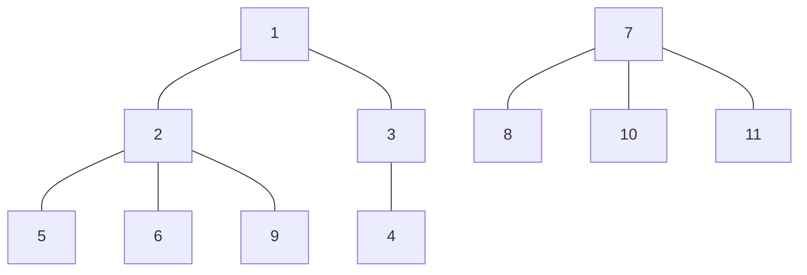
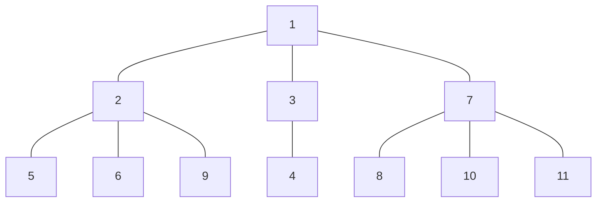
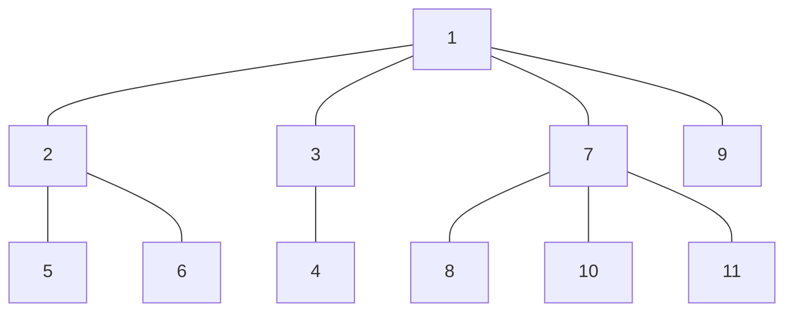

# Runtime and Disjoint Sets

This guide is meant to go over the key points of asymptotic runtime analysis and disjoint sets.

## Asymptotic Runtime
 The _runtime_ of a function is the way computer scientists describe how long it takes for that function to run. Runtime is usually measured in terms of $N$, the size of the input. We have 3 different ways of describing the runtime of a function:
 1. **$\Omega$**: The lower bound
 2. **$O$**: The upper bound
 3. **$\Theta$**: The _tight_ bound

**Common Mistake**: Many students try to write a $\Theta$ runtime for all functions. A function only has a $\Theta$ runtime if and only if its $\Omega$ and $O$ runtimes are equal. (That's where the name _tight bound_ comes from, since the upper and lower bounds are equal).

**Common Mistake**: Students often the say the best case is when $N$ is 1. This is not true. Remember, we are considering the _asymptotic runtime_ of the function, which is when $N \rightarrow \infty$.  Make sure you always consider the best and worst case when $N \rightarrow \infty$.

In section, we looked at 2 problems on runtime analysis. Here are the key takeaways:

**Key Takeaway**: Pictures/diagrams help a lot! In the case of the problems we looked at, it helped to draw out the 2D array so you could visualize what the code was doing.

**Key Takeaway**: It may be helpful to think in terms of the number of steps the function has to execute before returning. It might be helpful to record somehow on your diagram each step the function is taking, so you can easily keep track of the steps.

### Recursive Runtime
Runtime analysis of recursive functions is a more complicated, so it's a little hard to explain without being physically present. I'll take some time next section to go over some examples of recursive runtime.

## Disjoint Sets
### Abstract Data Types (ADTs)
Abstract data types are general descriptions of data structures that specify the behavior of the data structure. Some examples of ADTs you've seen so far are stacks and queues. A queue is an ADT because it is only characterized by a FIFO (first in, first out) behavior. To actually use a queue, you have to create a class that implements a queue, which is what you did in your first project.

**Key Takeaway**: Notice that all the ADTs you've seen so far are interfaces. This is not a coincidence. Just as interfaces are templates for classes, ADTs are templates for data structures.

The ADT you're focusing on now is sets. A set is an unordered collection of items. All you can do with sets is ask if an item is in the set, add an item to the set, and remove an item from the set.

**Common Mistake**: Students often forget that a set is _unordered_. You can't say something like "I want the 6th element in this set" like you can with arrays.

### Disjoint Sets and Weighted Quick Union
One application of sets is to keep track of connectivity of items. With disjoint sets, you can connect 2 items and ask if 2 items are connected. To implement disjoint sets, 61B uses a weighted quick union, which has 2 key operations:
- `connect(x, y)`: Connects `x` and `y`
- `isConnected(x, y)`: Checks if `x` and `y` are connected

A weighted quick union works by storing connected items in trees. For example if I had the numbers 1-4 and I wanted to `connect(1, 2)`, it would look like this:

At this stage, there are 3 trees: a tree rooted at 1, a tree rooted at 3, and a tree rooted at 4.

As you can see, `connect(x, y)` adds `x` to the tree containing `y`. But what it's actually doing is more nuanced. What if we had a lot more items to keep track of, like below?

When we `connect(6, 11)`, we will first find the root of the tree containing 6, then the root of the tree containing 11, and connect the roots. Since the root of 6 is 1 and the root of 11 is 7, our final tree will look something like:

where we just added a connection between 1 and 7.
> Note: Although finding the roots of the trees is not necessary to get the _correct_ behavior of a disjoint set, it results a more efficient implementation.

**Common Mistake**: After finding the roots of the trees, make sure to add a connection from the larger tree to the smaller tree. Students often forget this. Doing so results in a more efficient weighted quick union.

The process of finding the root nodes is done by an important helper method `find(x)`, which finds the root of the tree containing `x`. We'll see later how we can use `find` to make our weighted quick union even more efficient.

To check if `isConnected(x, y)`, we `find(x)` to get the root of the tree containing `x`, we `find(y)` to get the root of the tree containing `y`, and compare the roots. If the roots are the same, `x` and `y` are connected. If they aren't, `x` and `y` are not connected.

#### Path Compression
Our current weighted quick union connects roots of trees to connect items, which is great for efficiency. But we can do even better.

Recall the tree above:

What happens when we `find(9)`? We find the root of the tree containing 9, which is 1. But how do we get there? We start at 9, go to its parent 2, then go to its parent 1. Since 1 has no parent, it must be the root of the tree and we stop.

What if at some later point we wanted to `find(9)` again? We'd have to repeat the same procedure to determine that 1 is the root of the tree containing 9. But we already know from before that the root of 9 is 1, so we're doing more work than we have to. 

We need to somehow remember that we already found out that the root of 9 is 1. That's where _path compression_ comes in. When we `find(9)`, notice that we are taking a path going through 9, then 2, then 1. Once we've found out that the root of the tree is 1, we know not only that the root of the tree containing 9 is 1, but also that the root of the tree containing 2 is 1! We record this information by adding a connection between 9 and 1 and a connection between 2 and 1, and removing the old connection between 9 and 2:

Now, whenever we have to `find(9)` or `find(2)` it will only take 1 step to get to the root node! This makes the weighted quick union super efficient, since finding the root nodes of trees is the key to `connect` and `isConnected`.

# Conclusion
I hope you found this guide useful. As usual, please ask if you have any questions!
