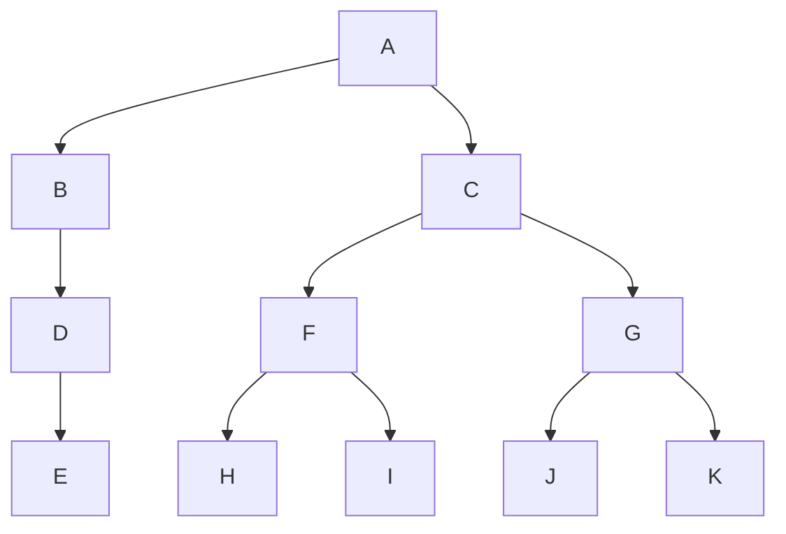

# ADTs and Binary Trees
This guide covers the basics of ADTs and binary trees and points out some common misconceptions and mistakes.
## Abstract Data Types (ADTs)
Abstract data types are general descriptions of data structures that specify the behavior of the data structure. I covered ADTs in last week's guide so I would encourage you to look at that guide if you still feel uncomfortable with ADTs. The most important thing to know about ADTs is that you can treat them as black boxes.

**Key Takeaway**: With ADT problems, the high-level strategy is:
- _Formulate the problem in terms of the operations of the ADTs you're given._ For example, in the `sumUp` problem, we figured out that checking if the array contains 2 numbers that sum to `n` could be done using the `contains` method of an ADT.
- _Choose the ADT that has the fastest implementation of the all the operations you need._ Taking `sumUp` as an example again, the operations we needed were `add` and `contains`. Both a `List` and a `Set` have these operations, so we had to choose which to use. Since a `Set` has constant-time `contains` (versus a `List` which takes $O(N)$ time for `contains`), we chose to use a `Set`.

## Binary Trees
A _binary tree_ is a tree in which every node can have at most 2 children. Although the specific implementation of a binary tree can vary, a basic implementation looks like:
```
public class BinaryTree<T> { 
	protected Node root; 
	protected class Node { 
		public T value; 
		public Node left; 
		public Node right; 
	} 
}
```
**Key Takeaway**: Since you aren't given an `isLeaf` method anymore, you have to define what a leaf is. In general, 61B is going to push you to think deeper about the data structures you use. In the case of a leaf, we figured out that a leaf is just a node without a left or right child.

There are some key words associated with binary trees:
- The _height_ of a binary tree, unless otherwise defined, is the length of the path from the root to the leaf furthest from the root.
- A binary tree is _balanced_ if its left and right subtrees are balanced and differ by at most 1 in height.
	- A balanced binary tree has at most $log(N)$ levels, where $N$ is the number of nodes in the tree.

**Common Mistake**: Students often forget the condition that a balanced binary tree must have balanced left and right subtrees. In other words, it's not enough for the left and right subtrees to have heights that differ at most by 1. To see why, consider this binary tree:

The left and right subtrees have equal height, but there are way more nodes in the right subtree than the left. Thus, this tree is not balanced.

**Common Mistake**: Just because a function operates on a binary tree does not make its runtime $log(N)$. You have to actually see what the function is doing to determine the runtime.

### Binary Search Trees
Binary Search Trees (BSTs) are binary trees in which the left child's value is less than the parent's value and the right child's value is greater than the parent's value. 

**Common Mistake**: Many students believe that a BST always has $log(N)$ levels because of the above property. That isn't true! Just like binary trees, BSTs can also have $N$ levels in the worst case.

#### Balanced Search Trees
There is a subclass of trees called balanced search trees which are guaranteed to be balanced. Only these trees are guaranteed to have $log(N)$ levels.
