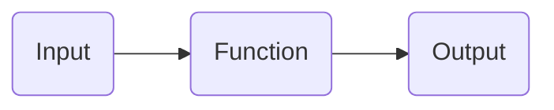
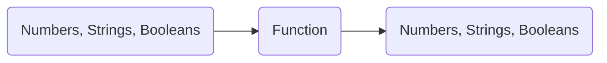
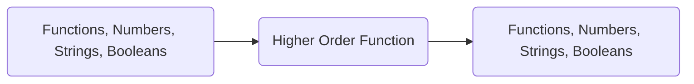

# Higher Order Functions

This guide is meant to go over the key ideas of higher order functions.

## Environment Diagrams

An environment diagram is a visual tool that helps you keep track of how code is executed by a computer. You've gotten a taste of what environment diagrams are through Python Tutor, but you haven't fully learned what exactly Python Tutor actually does. Using an environment diagram, you can walk through code step by step and determine the output in a foolproof way. No more having to do WWPD questions in your head!

_CS 88 has not taught you environment diagrams thoroughly in class, but if you learn how to use them now you will much more easily understand higher order functions, as well as everything else in the course._

It's hard to teach environment diagrams through a computer, so if you want to learn them I'm happy to meet with you one-on-one or we can schedule an extra section for me to teach it to you all as a group. CS61A has some [online resources](https://cs61a.org/resources.html#environment-diagrams) to help you with environment diagrams too.

## Motivating Higher Order Functions

The course is now introducing a concept called higher order functions. As the name suggests, higher order functions are functions. You've already seen functions, so what makes these functions different? Recall that a function just takes some input and generates an output. In a diagram, that looks something like this:

The functions you've seen before looked something like this:

where the allowed inputs and outputs were restricted to numbers, strings, and booleans.

_Higher order functions loosen the restriction on the input and output of functions._ A higher order function can take a function as an input and give a function as an output:


Ok, but why do we even need higher order functions? Suppose you wanted to write a function that returns the result of squaring a number `x` repeatedly `n` times. For example, squaring $3$ $2$ times is $(3^{2})^{2}$. We know how to do that:
```
def repeated_square(x, n):
	while n > 0:
		x = x * x
		n = n - 1
	return x
```

What if I wanted to write a function that returns the result of _cubing_ a number `x` repeatedly `n` times? I'd have to write a separate function:
```
def repeated_cube(x, n):
	while n > 0:
		x = x * x * x
		n = n - 1
	return x
```
For any operation I would like to apply to `x` repeatedly `n` times, I would have to write a separate function. Since there are an infinite number of operations I could apply to `x`, I would need to write an infinite number of functions to apply those operations.

With higher order functions, we can reduce the number of functions needed from $\infty$ to just $1$. Here's how it would look:
```
def repeated(f, x, n):
	while n > 0:
		x = f(x)
		n = n - 1
	return x
```
Notice that `repeated` takes in `f`, a function, as input whereas `repeated_square` and `repeated_cube` do not. Thus, `repeated` is a higher order function.

 `repeated` is just one example of a higher order function. There are a whole world of possibilities with higher order functions, and you'll get to explore some of them in the course.

# Conclusion
Higher order functions are a really powerful concept, but they are also difficult to understand at first. Environment diagrams are a great tool to facilitate your learning of higher order functions (and all other course material too!). As always, please let me know if you have any questions about anything I said here, or if you want to schedule a one-on-one with me so I can teach you environment diagrams.

